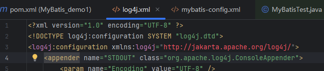

# 二、搭建MyBatis
 ##  7、加入log4j日志功能

### 问题描述：

使用IDEA进行开发配置log4j时原IDEA配置提示URL地址没有被注册

```xml
<?xml version="1.0" encoding="UTF-8" ?>
<!DOCTYPE log4j:configuration SYSTEM "log4j.dtd">
<log4j:configuration xmlns:log4j="http://jakarta.apache.org/log4j/">
```



------

### 解决方法：

原官方URL地址进行了更换，所以只需将配置地址进行相应修改即可（只修改URL也是会报错的，需要修改成下方所示）

```xml
<?xml version="1.0" encoding="GB2312" ?>
<!DOCTYPE log4j:configuration SYSTEM "http://logging.apache.org/log4j/1.2/apidocs/org/apache/log4j/xml/doc-files/log4j.dtd">

<log4j:configuration debug="true">

```


原笔记文档已更新